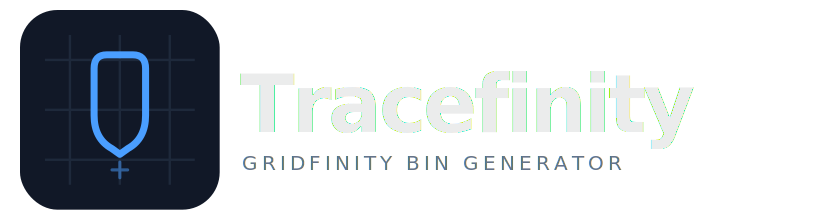

<p align="center">
  
</p>

<p align="center">
  <a href="https://github.com/tracefinity/tracefinity/releases"></a>
  <a href="https://github.com/tracefinity/tracefinity/actions"></a>
  <a href="https://github.com/tracefinity/tracefinity/pkgs/container/tracefinity"></a>
  <a href="https://github.com/tracefinity/tracefinity/blob/main/LICENSE"></a>
</p>

<p align="center">Generate custom <a href="https://gridfinity.xyz/">gridfinity</a> bins from photos of your tools.</p>

## How It Works

1. Place tools on A4/Letter paper (portrait or landscape)
2. Take a photo from above
3. Upload and adjust paper corners for scale calibration
4. AI traces tool outlines automatically
5. Save traced tools to your library
6. Create bins, add tools from the library, arrange the layout
7. Download STL/3MF for 3D printing

[Demo video](docs/tracefinity-demo.mp4)


## Quick Start

Try it at [tracefinity.net](https://tracefinity.net) without installing anything, or self-host:

### Docker

```bash
docker run -p 3000:3000 -v ./data:/app/storage -e GOOGLE_API_KEY=your-key ghcr.io/tracefinity/tracefinity
```

Open http://localhost:3000

The `GOOGLE_API_KEY` is optional -- you can use the manual mask upload workflow instead.

| Variable | Default | Description |
|-|-|-|
| `GOOGLE_API_KEY` | | Gemini API key (optional) |
| `GEMINI_IMAGE_MODEL` | `gemini-3-pro-image-preview` | Model for mask generation (see below) |

### From Source

Prerequisites: Python 3.11+, Node.js 20+

```bash
git clone https://github.com/tracefinity/tracefinity
cd tracefinity

# Optional: set your Gemini API key (or use the manual mask upload workflow)
export GOOGLE_API_KEY=your-key

# First time setup
cd backend && python3 -m venv venv && source venv/bin/activate && pip install -r requirements.txt
cd ../frontend && npm install
cd ..

# Run (starts backend on :8000 and frontend on :4001)
make dev
```

Open http://localhost:4001

## Features

- **AI-powered tracing** -- Gemini generates accurate tool silhouettes from photos
- **Manual mask upload** -- Use the Gemini web interface without an API key
- **Selective saving** -- Choose which traced outlines to keep before saving to your library
- **Tool library** -- Save traced tools and reuse them across multiple bins
- **Tool editor** -- Rotate tools, add/remove vertices, adjust outlines, snap to grid
- **Smooth or accurate** -- Toggle Chaikin subdivision for smooth curves, or keep the raw trace; SVG and STL exports both respect this
- **Finger holes** -- Circular, square, or rectangular cutouts for easy tool removal
- **Interior rings** -- Hollow tools (e.g. spanners) traced correctly with holes preserved
- **Bin builder** -- Drag and arrange tools with snap-to-grid, auto-sizing to fit the gridfinity grid
- **Cutout clearance** -- Configurable tolerance so tools fit without being too loose
- **Text labels** -- Recessed or embossed text on bins
- **Gridfinity compatible** -- Proper base profile, magnet holes, stacking lip
- **Live 3D preview** -- See your bin in three.js before printing
- **STL and 3MF export** -- 3MF supports multi-colour printing for embossed text
- **SVG export** -- Individual tool outlines as SVG, with smoothing applied
- **Bed splitting** -- Large bins auto-split into printable pieces with diagonal fit detection
- **Landscape and portrait** -- Paper orientation auto-detected from corner positions
- **Single-container Docker** -- Frontend and backend in one image, data in a single volume

## How the AI Tracing Works

Tracefinity uses Google's [Gemini API](https://ai.google.dev/) to generate mask images from photos.

1. Your photo is sent to Gemini with a prompt asking for a black and white silhouette mask
2. Gemini returns a mask image with tools in black, background in white
3. OpenCV traces the contours from the mask to create editable polygons
4. A second Gemini call identifies what each tool is (for labelling)

The UI shows you exactly what prompts are sent before you click "Trace".

### Model selection

Set `GEMINI_IMAGE_MODEL` to choose which Gemini model generates masks:

| Model | Pros | Cons |
|-|-|-|
| `gemini-3-pro-image-preview` (default) | Best mask quality, pixel-accurate alignment | Preview model, occasional outages |
| `gemini-2.5-flash-image` | Faster, cheaper, GA | Returns arbitrary dimensions, needs post-hoc alignment (~5px tolerance) |

The flash model returns masks at different dimensions than requested, so Tracefinity uses template matching to align the mask to the original photo. This adds ~20ms and gets within a few pixels.

### Why Gemini?

Several approaches were tested before settling on Gemini's image generation:

- **OpenCV** -- Traditional computer vision (edge detection, thresholding, watershed) struggles with varied lighting, shadows, and tools that blend into backgrounds
- **OpenAI/Anthropic** -- Vision models can describe images but can't generate the mask images needed for contour extraction
- **Gemini** -- Image generation models can both understand the photo and generate a clean silhouette mask, handling shadows and complex shapes reliably

To get an API key: [Google AI Studio](https://aistudio.google.com/apikey) (free tier available).

## Manual Mask Upload

No API key? No problem:

1. Upload your photo and set paper corners
2. Click "Manual" and download the corrected image
3. Open [Gemini](https://gemini.google.com) and paste the image with the provided prompt
4. Download the generated mask (black tools on white background)
5. Upload the mask back to Tracefinity

## What is Gridfinity?

[Gridfinity](https://gridfinity.xyz/) is a modular storage system designed by [Zack Freedman](https://www.youtube.com/watch?v=ra_9zU-mnl8). Bins snap into baseplates on a 42mm grid, making it easy to organise tools, components, and supplies. The system is open source and hugely popular in the 3D printing community.

## Licence

MIT
